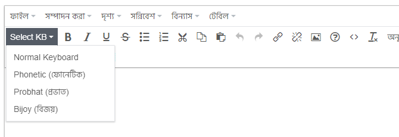

# Bengali JS Keyboard
Bengali JS Keyboard Plugin for TinyMCE




## How to install the plugin
1. copy `bangla-kb` folder to the tinymce plugins folder.
2. set up your instance in the tinyMCE.init method to use the plugin, like:
```
plugins : "... bangla-kb ..."
```
3. set up your instance to use the button, for example:
```
toolbar : "... | bangla-kb"
````
